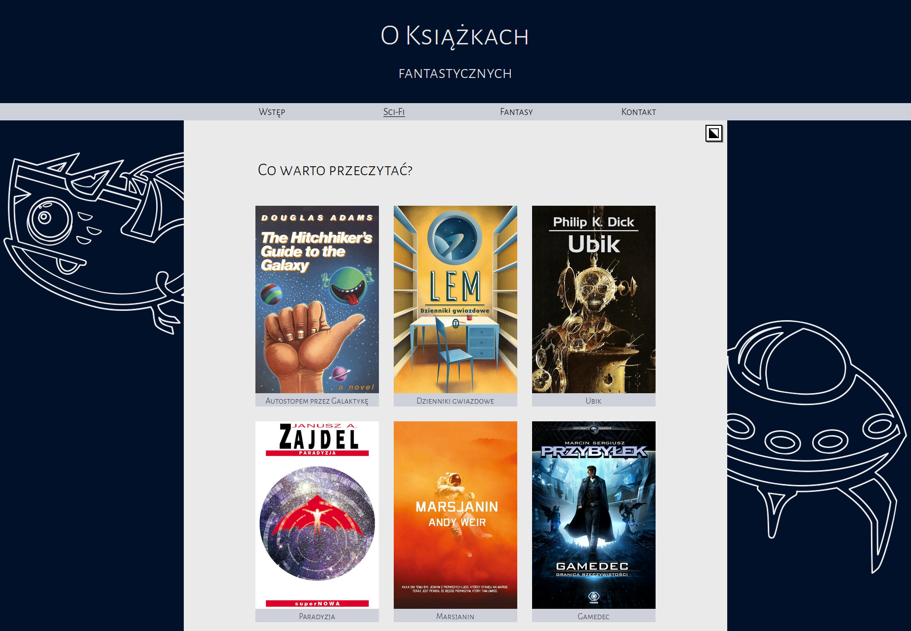

# README #

Simple static website made as a university project.

Website created in accordance with the given requirements. No frameworks were used, no backend.

To view just clone the repository and open index.html
 
## Screenshot

